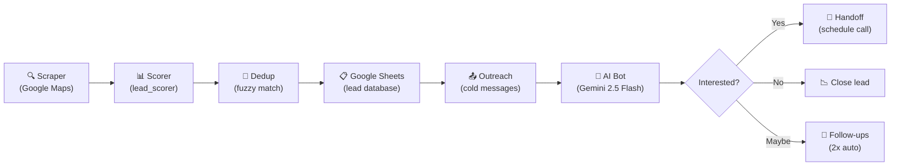

# AI Web Automation — Lead Scraper + WhatsApp Bot

Automated pipeline that scrapes businesses without websites, scores them, and cold-outreaches via WhatsApp with an AI-powered conversation bot. Runs entirely on free-tier services (₹0/month).

## Features

- 🔍 **Lead Scraping** — Google Maps + JustDial, with fuzzy deduplication
- 📱 **WhatsApp Bot** — AI-powered conversations via Gemini 2.5 Flash
- 📊 **Google Sheets** — Auto-managed lead database with caching
- 🔄 **Circuit Breaker** — Auto-recovery from API failures
- 📬 **Message Queue** — Priority-based sending with rate limiting
- 🛡️ **Webhook Security** — HMAC-SHA256 signature verification (dual-format)
- 💾 **Local Fallback** — Zero data loss when Sheets quota is exhausted
- 📈 **Quota Monitoring** — `/health` and `/health/detailed` endpoints
- ✅ **Config Validation** — Startup checks for all required env vars

## Pipeline Flowchart



## Quick Start

### 1. Install Python dependencies

```bash
cd ai-web-automation
python -m venv venv
venv\Scripts\activate        # Windows
# source venv/bin/activate   # Mac/Linux
pip install -r requirements.txt
playwright install chromium
```

### 2. Set up credentials

```bash
# Copy the env template
copy config\.env.example config\.env     # Windows
# cp config/.env.example config/.env     # Mac/Linux
```

Edit `config/.env` and fill in:
- `GEMINI_API_KEY` — from https://aistudio.google.com/app/apikey
- `GOOGLE_SHEETS_ID` — the spreadsheet ID from its URL
- `TELEGRAM_BOT_TOKEN` + `TELEGRAM_CHAT_ID` — from @BotFather
- WhatsApp credentials (Meta or whatsapp-web.js mode)

Place your OAuth credentials file at:
```
config/credentials/oauth_credentials.json
```

### 3. First run (OAuth authorization)

The first time you access Google Sheets, a browser window will open asking you to authorize. After that, a `token.json` is saved and subsequent runs are automatic.

### 4. If using whatsapp-web.js (Option B)

```bash
cd phase2_whatsapp/whatsapp_web_js
npm install
npm start
# Scan the QR code with WhatsApp
```

### 5. Start the server

```bash
cd ai-web-automation
python -m server.app
```

This starts:
- FastAPI server on `http://localhost:8000`
- Daily scraper (6 AM IST)
- Outreach scheduler (every 2 hrs, 9 AM – 8 PM IST)
- Daily Telegram summary (9 PM IST)

### 6. Manual test scrape

```bash
python -c "from phase1_leads.google_maps_scraper import scrape; print(scrape('Delhi', 'Restaurant'))"
```

## Run Tests

```bash
# Run all unit tests (no external services needed)
python -m pytest tests/ -v --ignore=tests/test_sheets_client.py

# Run specific test suites
python -m pytest tests/test_phone_utils.py -v         # 21 phone tests
python -m pytest tests/test_webhook_security.py -v    # webhook HMAC tests
python -m pytest tests/test_gemini_rate_limit.py -v   # rate limit + threading
python -m pytest tests/test_lead_dedup.py -v          # dedup + fuzzy matching
python -m pytest tests/test_whatsapp_bridge.py -v     # bridge retry logic
```

## Project Structure

```
ai-web-automation/
├── config/              # Settings, .env, OAuth credentials
├── phase1_leads/        # Google Maps + JustDial scrapers, scorer, dedup
├── phase2_whatsapp/     # WhatsApp bot, conversation engine, templates
│   └── whatsapp_web_js/ # Node.js bridge for whatsapp-web.js (Option B)
├── utils/               # Shared utilities
│   ├── phone_utils.py       # Centralized phone validation/normalization
│   ├── config_validator.py  # Startup env var checks
│   ├── gemini_client.py     # Gemini 2.5 Flash with rate limiting
│   ├── sheets_client.py     # Google Sheets with retry decorator
│   ├── circuit_breaker.py   # Auto-recovery from API failures
│   ├── message_queue.py     # Priority queue for WhatsApp sends
│   ├── local_storage.py     # Fallback when Sheets quota exhausted
│   └── telegram_alert.py    # Admin alerts via Telegram
├── server/              # FastAPI server + APScheduler
├── tests/               # Unit + integration tests
└── data/                # Local fallback storage (auto-created)
```

## VPS Server Management

If you have deployed this project to a Linux VPS (e.g. Hetzner) using the `whatsapp-bot.service` systemd service, use these commands to manage it.

### 1. How to Run the Bot on the Server
Start the bot service and enable it to start automatically on system boot:
```bash
# Enable the service (runs on system boot)
systemctl enable whatsapp-bot

# Start the bot service immediately
systemctl start whatsapp-bot
```

### 2. How to Check Current Status of the Bot on the Server
Verify that the bot is running, inspect details, and view console logs:
```bash
# Check if the service is active and running
systemctl status whatsapp-bot

# View the last 50 lines of logs
journalctl -u whatsapp-bot -n 50 --no-pager

# View live logs in real-time (press Ctrl + C to exit)
journalctl -u whatsapp-bot -f
```

### 3. How to Stop the Bot in the Server
Stop the background execution of the bot:
```bash
# Stop the bot service
systemctl stop whatsapp-bot

# Disable auto-start on boot (optional)
systemctl disable whatsapp-bot
```

### 4. Restarting the Bot
If you modify `.env` or configurations, restart the service to apply changes:
```bash
# Restart the bot service
systemctl restart whatsapp-bot
```

## API Endpoints

| Endpoint | Method | Description |
|---|---|---|
| `/health` | GET | System health + Gemini quota usage |
| `/health/detailed` | GET | Full status: circuit breakers, local storage, all quotas |
| `/webhook/whatsapp` | GET/POST | Meta Cloud API webhook (verification + messages) |
| `/webhook/incoming` | POST | whatsapp-web.js incoming messages |

## Free-Tier Limits & Troubleshooting

| Service | Free Tier Limit | What Happens When Exhausted |
|---------|----------------|----------------------------|
| **Gemini 2.5 Flash** | 1,500 req/day, 15 RPM | Requests blocked until midnight IST, auto-resumes |
| **WhatsApp Cloud API** | 1,000 convos/month | Outreach paused, admin alerted via Telegram |
| **Google Sheets** | 300 reads/min, 60 writes/min | Falls back to local JSON storage, syncs later |
| **Telegram Bot** | Unlimited | Always available |
| **Playwright** | N/A (local) | No limits, runs headless Chromium |

### Troubleshooting Guide

#### "Gemini daily quota exhausted"
- **What it means**: The system automatically blocks requests after 1,450 calls/day (safety margin below 1,500 limit).
- **How to check**: `GET http://localhost:8000/health` → `gemini_quota.daily_remaining` shows remaining calls.
- **When it resets**: Midnight in the configured `TIMEZONE` (default: IST / `Asia/Kolkata`).
- **Workaround**: The Gemini client returns cached responses for repeated queries.

#### "Circuit breaker OPEN"
- **What it means**: A service (Gemini, WhatsApp, or Sheets) failed too many times consecutively (5 for Gemini/Sheets, 3 for WhatsApp).
- **Auto-recovery**: The circuit breaker enters `HALF_OPEN` state after a cooldown (60-120s) and allows one test request through. If it succeeds, normal operation resumes.
- **How to check**: `GET http://localhost:8000/health/detailed` → `circuit_breakers.<service>.state`.

#### "Sheets fallback active"
- **What it means**: Google Sheets API quota exhausted; data is saved to `data/local_fallback/` as JSON files.
- **Data safety**: Zero data loss — all leads and conversations are preserved locally.
- **Auto-sync**: The system automatically syncs local data back to Sheets when quota resets.
- **Where data is stored**: `data/local_fallback/pending_leads.json` and `data/local_fallback/pending_conversations.json`.

#### "Webhook signature invalid"
- **What it means**: The incoming webhook request failed HMAC-SHA256 verification.
- **Common fixes**: Ensure `META_APP_SECRET` in your `.env` matches the App Secret in your Facebook App Dashboard → Settings → Basic.
- **Debug**: Check server logs — signature mismatches are logged at DEBUG level with truncated hash values.

### Switching WhatsApp Modes

Switch between Meta Cloud API and whatsapp-web.js by changing `WHATSAPP_MODE` in your `.env`:

```bash
# Option A: Meta Cloud API (recommended, most reliable)
WHATSAPP_MODE=meta_cloud

# Option B: whatsapp-web.js (requires Node.js, no Meta account needed)
WHATSAPP_MODE=whatsapp_web_js
```

After switching, restart the server. If using whatsapp-web.js, ensure the Node server is running first.

## Monthly Cost: ₹0

All tools used are free tier: Gemini API, Google Sheets, Telegram Bot, Meta WhatsApp Cloud API, Playwright.
